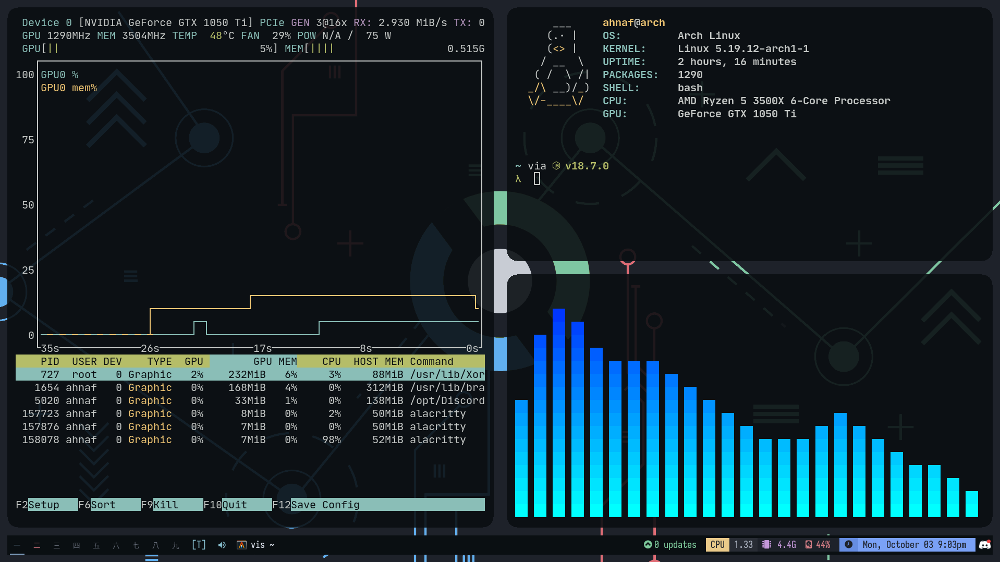

# ChadWM (My riced version)


I've been using DWM for a while, so I thought why not used ChadWM cuz I'm a chad.

FYI, ChadWM is basically a DWM rice/modif. So I basically riced the rice :)

## Note

This project a modification of the real [ChadWM](https://github.com/siduck/chadwm). Since the upstream is on GitHub, I couldn't
fork it on GitLab.


# Screenshots



# Requirements

- dash (shell)
- imlib2 
- xsetroot package (status2d uses this to add colors on dwmbar)
- JetbrainsMono Nerd Font and Iosevka Font
- Materiald design icon font - [link](https://github.com/Templarian/MaterialDesign-Font/blob/master/MaterialDesignIconsDesktop.ttf)
- Make sure to setup your terminal's theme accordingly do chadwm's theme such as nord, onedark etc...

## Other requirements
- picom
- feh
- acpi
- rofi
- pavucontrol

# Install (from AUR)

```
yay -S chadwm-devguyahnaf-git
```

# Install (manually)

```
git clone https://github.com/ahnaf-zamil/chadwm --depth 1  ~/.config
cd ~/.config/chadwm/
sudo make install
```

# Run chadwm

## With startx

```shell
startx ~/.config/chadwm/scripts/run.sh
```

## With sx

```shell
sx sh ~/.config/chadwm/scripts/run.sh
```

(Make an alias for this :v)

```shell
alias chadwm='startx ~/.config/chadwm/scripts/run.sh'
```

## With Display Manager

- Create a desktop entry (make sure to change `user` with your user):

```shell
sudo touch /usr/share/xsessions/chadwm.desktop  
```

```
[Desktop Entry]
Name=chadwm
Comment=dwm made beautiful 
Exec=/home/user/.config/chadwm/scripts/./run.sh 
Type=Application 
```

- [wallpaper](https://github.com/siduck/chadwm/blob/screenshots/screenshots/chad.png)

# Recompile

- You need to recompile dwm after every change you make to its source code.

```
cd ~/.config/chadwm/chadwm
rm config.h
sudo make install
```

# Change themes

- Bar  : in bar.sh (line 9) and config.def.h (line 35)
- rofi : in config.rasi (line 15)

# Credits (from origin author)

- HUGE THANKS to [eProTaLT83](https://www.reddit.com/user/eProTaLT83). I wanted certain features in dwm like tabbar in monocle, tagpreview etc and he implemented my ideas and created patches for me! I can't even count the number of times he has helped me :v
- @fitrh helped with [colorful tag patch](https://github.com/fitrh/dwm/issues/1)
- [6gk](https://github.com/6gk/fet.sh), eww's pure posix fetch functions taken from here
- [mafetch](https://github.com/fikriomar16/mafetch), modified version of this was used as fetch in the screenshots

# Patches

- barpadding 
- bottomstack
- cfacts
- dragmfact 
- dragcfact (took from [bakkeby's build](https://github.com/bakkeby/dwm-flexipatch))
- fibonacii
- gaplessgrid
- horizgrid
- movestack 
- vanity gaps
- colorful tags
- statuspadding 
- status2d
- underline tags
- notitle
- winicon
- [preserveonrestart](https://github.com/PhyTech-R0/dwm-phyOS/blob/master/patches/dwm-6.3-patches/dwm-preserveonrestart-6.3.diff). This patch doesnt let all windows mix up into tag 1 after restarting dwm.
